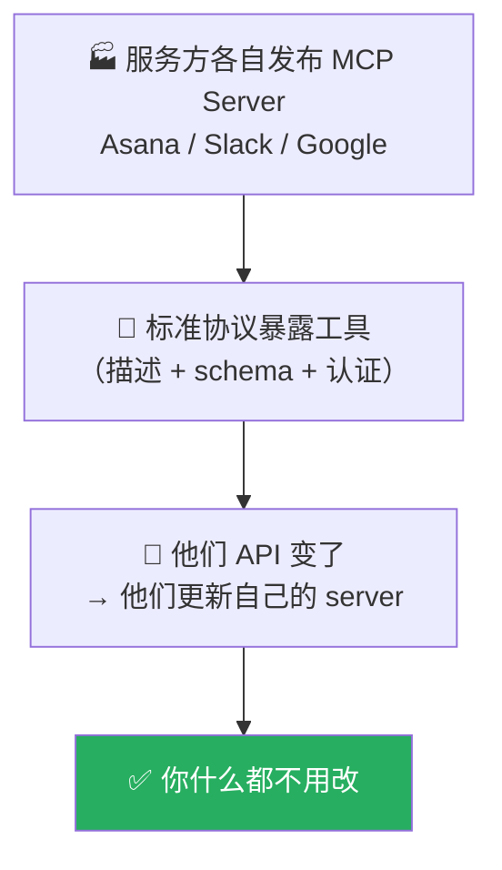

# Claude Platform 101: 《MCP》把集成维护甩给服务方

> **课程出处**：Anthropic 官方 Claude Academy (`academy.claude.com/courses/claude-platform-101/mcp`)  
> **课程定位**：有了 Tools 和 Skills，为什么还要 MCP？初看像"API 之上再叠一层 API"——答案在于**谁维护集成代码**：服务方发布并维护 MCP server，API 变了你什么都不用改  
> **核心主题**：维护责任转移、Tools/Skills/MCP 三分法、mcp_servers 声明与 mcp_toolset 授权、工具级开关  
> **课程时长**：约 6 分钟（第 9/13 课）

---

## 目录
1. [维护问题：MCP 存在的理由](#1-维护问题mcp-存在的理由)
2. [Tools vs Skills vs MCP 三分法](#2-tools-vs-skills-vs-mcp-三分法)
3. [连接 MCP Server](#3-连接-mcp-server)
4. [过滤可用工具](#4-过滤可用工具)
5. [实战 Cheatsheet](#5-实战-cheatsheet)

---

## 1. 维护问题：MCP 存在的理由

场景：Agent 要**同时**拉 Asana 任务、查 Google 日历、搜 Slack——

- **用自定义工具**：写三个集成，可行；痛苦在后面——**每次这些服务改 API（很频繁），你都得维护**这些集成
- 恭喜，你成了"第三方 API 包装器维护工"

**MCP 把维护转移给服务方**：



---

## 2. Tools vs Skills vs MCP 三分法

| 机制 | 连接对象 | 谁维护 |
| :--- | :--- | :--- |
| **Tools** | **你的**内部系统（数据库、项目追踪、私有 API） | 你（代码归你，维护归你） |
| **Skills** | **你的**流程（报告模板、审查清单）——是指令，不一定是集成 | 你 |
| **MCP** | **第三方**服务 | **服务方**（Asana 的包装器 Asana 自己写好了） |

> 🎯 **一句话**：**Tools are for your stuff, Skills are for your processes, and MCP is for everyone else's stuff.**  
> （Tools 管你的东西，Skills 管你的流程，MCP 管别人的东西。）

---

## 3. 连接 MCP Server

以 **Linear MCP server** 为例（连接信息与 auth token 存 `.env`）。请求里两件套配合：

- **`mcp_servers`**：声明连接——type、URL、名称、（可选）auth token
- **`mcp_toolset`** 类型的 tool：配置 Claude 能用该 server 的**哪些工具**（默认全部）

```python
import os
import anthropic

client = anthropic.Anthropic()

response = client.beta.messages.create(
    model="claude-opus-5",
    max_tokens=1024,
    messages=[
        {"role": "user", "content": "What tools do you have available?"}
    ],
    mcp_servers=[
        {
            "type": "url",
            "url": "https://mcp.linear.app/mcp",
            "name": "linear",
            "authorization_token": os.environ["LINEAR_MCP_TOKEN"],
        }
    ],
    tools=[
        {
            "type": "mcp_toolset",
            "mcp_server_name": "linear",
        }
    ],
    betas=["mcp-client-2025-11-20"],  # 目前 beta，需带 header
)
print(response)
```

### 关键：零 schema

> **一个工具 schema 都没写。** Claude **introspects（自省）** server，拿回工具列表和 schema，自行挑对的用。

运行效果：Claude 列出 Linear 的工具，然后调用其中一个。任何合规 server 都同样适用——**没定义工具、没写 Linear 客户端，Linear 自己在维护**。

---

## 4. 过滤可用工具

MCP server 往往暴露**很多**工具，你不一定全想给：

- 不想 Claude 有**写权限**
- 不想让一堆工具定义**占上下文**

**模式：默认全禁，按名开启**（Slack 示例）：

```python
tools=[
    {
        "type": "mcp_toolset",
        "mcp_server_name": "slack",
        "default_config": {
            "enabled": False,          # 默认全禁
        },
        "configs": {
            "search_messages": {"enabled": True},   # 只开这两个
            "list_channels": {"enabled": True},
        },
    }
]
```

效果：Claude 能**搜 Slack、列频道**，但**不能发帖、不能删除**。

> 💡 信任一个服务的**读**、不想它替你**写**时，这就是抓手——与 Cowork L11 的权限收窄原则同源。

---

## 5. 实战 Cheatsheet

```markdown
### 🔌 API 端 MCP 速查

#### 1. 为什么存在
集成代码的维护责任转移：
服务方发布并维护 MCP server，API 变了 → 服务方改，你零改动

#### 2. 三分法口诀
Tools 管你的东西 / Skills 管你的流程 / MCP 管别人的东西

#### 3. 连接两件套
mcp_servers: [{type:"url", url, name, authorization_token}]
tools: [{type:"mcp_toolset", mcp_server_name}]
Claude 自省 server 发现工具——零 schema

#### 4. 工具级开关
default_config: {enabled: False} 全禁
configs: {工具名: {enabled: True}} 按名开
（例：Slack 只读——能搜能列，不能发不能删）

#### 5. 状态
beta，请求带 betas=["mcp-client-2025-11-20"]

#### 6. 资源
modelcontextprotocol.io —— server 列表与协议文档
```

### 课程衔接

> 🔗 **下一课**：L10《Context management》——长跑 Agent 如何待在窗口内、还付得起账单：四大模式。
