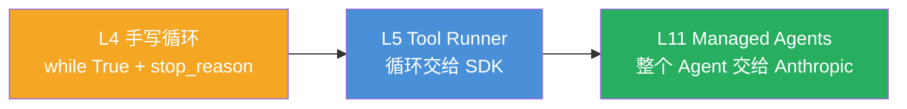
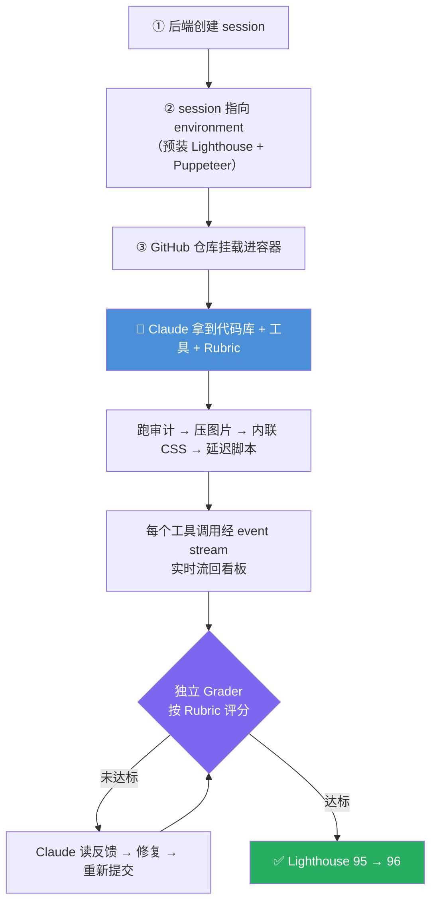
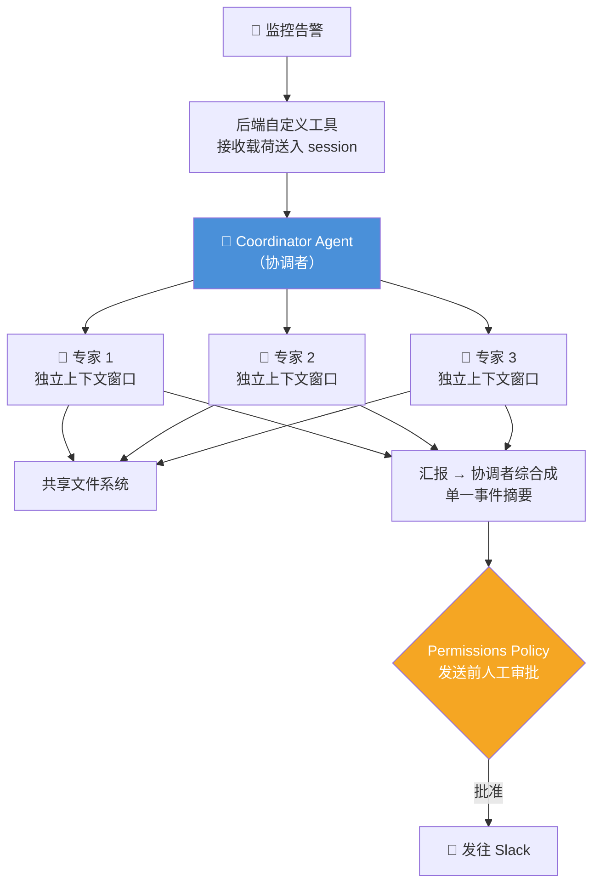

# Claude Platform 101: 《What are managed agents?》托管 Agent：把循环甩给 Anthropic

> **课程出处**：Anthropic 官方 Claude Academy (`academy.claude.com/courses/claude-platform-101/what-are-managed-agents`)  
> **课程定位**：L4 你手写了 Agent 循环，L5 的 Tool Runner 砍掉样板——**Managed Agents 走到光谱尽头：把整个 Agent 托管到 Anthropic 基础设施上运行**；你定义 Agent（工具/人设/能力），配置沙箱环境，从自己的应用发起点火，Claude 在隔离容器里干活（完整文件系统 + bash + 网搜）  
> **核心主题**：托管循环、三大示例（看板自动化 / 记忆型研究 / 多 Agent 应急）、八大构建块  
> **课程时长**：约 7 分钟（第 11/13 课）

***

## 目录

1. [托管的本质：替你运行的 Agent 循环](#1-托管的本质替你运行的-agent-循环)
2. [示例一：会干活的看板](#2-示例一会干活的看板)
3. [示例二：带记忆的周期研究 Agent](#3-示例二带记忆的周期研究-agent)
4. [示例三：多 Agent 应急响应](#4-示例三多-agent-应急响应)
5. [八大构建块](#5-八大构建块)
6. [实战 Cheatsheet](#6-实战-cheatsheet)

***

## 1. 托管的本质：替你运行的 Agent 循环

> Under the hood, this is an **agent loop**: Claude reasons, calls a tool, reads the result, and repeats until the job is done. Managed agents takes that same loop and **hosts it on Anthropic's infrastructure**, so you don't have to run it.



* 底层还是熟悉的循环：推理 → 调工具 → 读结果 → 重复直到完成

* 区别：**循环跑在 Anthropic 的基础设施上**，你不用运行它

* 容器内：**完整文件系统访问 + bash 执行 + 网络搜索**

* 入口：Claude Console 里的独立专区

***

## 2. 示例一：会干活的看板

看板架在 Managed Agents 上：把工单拖进 "in progress" 列，**自动触发一个 session**。

工单内容："optimize website performance"（优化网站性能）



**Rubric（评分标准）定义"什么算完成"**：

* Lighthouse 分数 > 90

* 无渲染阻塞资源

* 所有图片懒加载

**关键机制**：

1. **Grader 独立上下文窗口**——单独评分，不受执行 Agent 的会话偏见影响（呼应 Claude Code L5 的 Subagent 审查）
2. **并行**：第一个还在跑时可以拖第二张工单——**两个 session、两个容器、两个任务并行**

***

## 3. 示例二：带记忆的周期研究 Agent

任务形态不同：追踪公司所有 SaaS 工具的**价格与套餐变动**，每天站会前出好报告。

每次运行，Agent：

1. **网搜**当前定价页，查套餐层级变化，标记可能影响合同的新功能
2. 在沙箱里**用 Python 跑成本分析**
3. 用 **Excel 表格 Skill** 写执行摘要
4. 通过 **MCP server** 发 Slack 链接 + 在 Asana 建审查任务

### Memory 是灵魂

> 开工前：查**上周发现了什么**。收工后：存**这周什么变了**。

* 有记忆：报告能写"**计算成本比上周降了 15%**"

* 无记忆：每周罗列同样的静态定价数据

> 💡 呼应 L10 Memory 工具——API 原语在托管场景下的落地形态。

***

## 4. 示例三：多 Agent 应急响应

监控栈告警触发 → 后端**自定义工具**接收告警载荷 → 作为 tool result 送进新 session → 该 session 使用**多 Agent 协同**：



两个亮点：

* **权限策略**：摘要发 Slack 前**弹给你审批**——敏感动作等人（呼应 Cowork L11「Claude can prepare; you ship」）

* **Memory 关联历史**：协调者查过往事件库，发现"这像两周前那次由 TTL 配置错误引起的 DNS 解析问题"——下次同类告警，**带着上下文开工，不用从零诊断**

***

## 5. 八大构建块

| 构建块                          | 职责                        | 示例对应                   |
| :--------------------------- | :------------------------ | :--------------------- |
| **Agents**                   | 定义：工具、人设、能力               | 性能优化 Agent / 研究 Agent  |
| **Sessions**                 | 从你的应用发出的单次运行              | 拖卡触发一次                 |
| **Environments**             | 沙箱：预装包 + 网络控制             | Lighthouse + Puppeteer |
| **Tools**                    | 含你后端的自定义工具                | 接收告警载荷                 |
| **MCP**                      | 连接 Slack / Asana 等服务      | 发通知、建任务                |
| **Memory**                   | 开工前读、收工后写                 | "成本降 15%"、历史事件         |
| **Outcomes**                 | Rubric + Grader 定义并检查"完成" | Lighthouse > 90        |
| **Multi-agent coordination** | 协调者委派专家                   | 应急响应三人组                |

> 🎯 **本课金句**：**You define what done looks like. Claude works until it gets there.**  
> （你定义"完成"长什么样，Claude 一直干到达标为止。）

***

## 6. 实战 Cheatsheet

```markdown
### 🏗️ Managed Agents 速查

#### 1. 定义
一套构建和规模化部署 Agent 的 API
循环托管在 Anthropic 基础设施：隔离容器 + 文件系统 + bash + 网搜

#### 2. 托管光谱（本课程主线）
手写循环（L4）→ Tool Runner（L5）→ Managed Agents（L11）

#### 3. 核心机制
- session 从你的应用发出，指向预配置的 environment
- 工具调用经 event stream 实时流回你的应用
- Rubric 定义"完成"；独立 Grader 评分 → 不达标就迭代
- 多 session 并行：两容器两任务互不干扰

#### 4. 三示例一句话
① 看板自动化：拖卡触发，Grader 逼着迭代到 Lighthouse 96
② 周期研究：Memory 让报告有"环比上周"而非静态罗列
③ 应急响应：协调者+三专家，Permissions Policy 人审后发 Slack

#### 5. 八大构建块
Agents / Sessions / Environments / Tools /
MCP / Memory / Outcomes / Multi-agent coordination

#### 6. 金句
You define what done looks like. Claude works until it gets there.
```

### 课程衔接

> 🔗 **下一课**：L12《Building your first managed agent》——动手构建第一个托管 Agent，消费 event stream。

<br />
