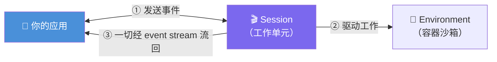

# Claude Platform 101: 《Building your first managed agent》构建第一个托管 Agent

> **课程出处**：Anthropic 官方 Claude Academy (`academy.claude.com/courses/claude-platform-101/building-your-first-managed-agent`)  
> **课程定位**：手写循环对很多功能是正确形状，但当循环要**跑几分钟甚至几小时**、跨多个工具、要保状态、写文件、断网后还要能续跑时——你不想在自己服务器上跑它，你要**委派**；本课用五步构建最小可用托管 Agent  
> **核心主题**：四大原语、五步流程、事件流消费（先开流再点火）、agent_toolset、手动 vs 托管的取舍  
> **课程时长**：约 8 分钟（第 12/13 课）

---

## 目录
1. [什么时候该委派循环](#1-什么时候该委派循环)
2. [四大原语](#2-四大原语)
3. [五步构建最小托管 Agent](#3-五步构建最小托管-agent)
4. [交易：你交出了什么，换回了什么](#4-交易你交出了什么换回了什么)
5. [实战 Cheatsheet](#5-实战-cheatsheet)

---

## 1. 什么时候该委派循环

手写循环（L4）的痛点场景：

- 循环要跑**很久**——分钟级甚至小时级
- **跨很多工具**，有状态要保、有文件要写
- **网络抖动后要能续跑**（resumability）

> At that point, you don't want to run the loop on your server. **You want to delegate it.**

**Managed Agents 的定义**：跑在 **Anthropic 基础设施**上的 Agent 循环——你描述一次 Agent、给它一个环境、发起 session，Anthropic 跑循环，你只管把事件流接出来。

> 💡 每个 API 账号**默认开启**，无需特殊权限。

---

## 2. 四大原语

> 四个原语，按顺序出场：

| # | 原语 | 定义 | 复用性 |
| :--- | :--- | :--- | :--- |
| 1 | **Agent** | 人设：模型 + 系统提示词 + 工具集 | **跨多次运行复用** |
| 2 | **Environment** | 运行场所：云或自托管、网络配置等 | 容器模板 |
| 3 | **Session** | 某环境中一次 Agent 运行 | **工作单元** |
| 4 | **Events** | 进出的消息：动作、工具调用、结果、回复 | 一切皆事件 |



> 🎯 **范式转变**：你不再跑 while 循环——**你发送事件、读取事件**。

---

## 3. 五步构建最小托管 Agent

任务：在临时目录建文件、数行数、汇报——用 **agent toolset**（Anthropic 预打包的 file / bash / web 工具），**无需自定义任何工具**。

### Step 1：创建 Agent（一次创建，多次复用）

```python
agent = client.beta.agents.create(
    name="Line Counter",
    model="claude-opus-5",
    system="You are a helpful agent that completes small file tasks.",
    tools=[
        {"type": "agent_toolset_20260401", "default_config": {"enabled": True}}
    ],
)
```

### Step 2：创建 Environment（容器模板）

```python
environment = client.beta.environments.create(
    name="line-counter-env",
    config={
        "type": "cloud",
        "networking": {"type": "unrestricted"},
    },
)
```

### Step 3：创建 Session（工作单元）

```python
session = client.beta.sessions.create(
    agent=agent.id,
    environment_id=environment.id,
    title="Count lines demo",
)
```

### Step 4：先开流，再点火（⚠️ 顺序坑）

```python
with client.beta.sessions.events.stream(session_id=session.id) as stream:
    # 流已打开——现在才发 kickoff
    client.beta.sessions.events.send(
        session_id=session.id,
        events=[
            {
                "type": "user.message",
                "content": [
                    {
                        "type": "text",
                        "text": "Create a file in the temp directory, "
                                "count its lines, and report back.",
                    }
                ],
            },
        ],
    )
```

> ⚠️ **为什么先开流**：event stream **只投递它打开之后发生的事件**——先发 kickoff 再开流会漏掉事件。注意方法是 `events`（**复数**）：这个 API 里一切皆事件。

### Step 5：消费事件流

demo 里三种事件类型最重要：

```python
    for event in stream:
        if event.type == "agent.message":          # Claude 的文本
            for block in event.content:
                if block.type == "text":
                    print(block.text, end="", flush=True)
        elif event.type == "agent.tool_use":       # Claude 挑了什么工具
            print(f"\n[tool] {event.name}")
        elif event.type == "session.status_idle":  # Agent 干完了
            print("\n--- Agent done ---")
            break
```

| 事件类型 | 含义 |
| :--- | :--- |
| `agent.message` | Claude 的文本输出 |
| `agent.tool_use` | Claude 选用的工具 |
| `session.status_idle` | **Agent 完成**，可以收工 |

运行输出：Agent 边干边"说"——真实文本、选的工具、最终答案，**全部跑在 Anthropic 的容器里，不是你的**。

---

## 4. 交易：你交出了什么，换回了什么

| 手动循环（L4） | 托管 Agent（本课） |
| :--- | :--- |
| 循环自己跑、事事自己控 | **委派**循环、沙箱、可续跑性 |
| while + stop_reason switch | **发送事件 + 消费事件流** |

### 生产形态

> 长时运行、要碰文件、"帮我把这个整理好"类任务的形状。

官方示例——**文件共享区清理**：

- Managed Agent 读目标目录结构规范 → 遍历混乱的 incoming 文件夹 → 把文件归入正确项目目录
- 归档重复文件和零字节垃圾，**没把握归类的打标记**
- 一个 session 对着**数千个文件跑几分钟**
- 仪表盘实时流式展示 Agent 的整理、归档、标记动作

### 选择标准

| 场景 | 选择 |
| :--- | :--- |
| 循环会**跑太久、干太多、要扛网络抖动** | Managed Agents |
| 想要**完全控制**每一步 | 手动循环 |

---

## 5. 实战 Cheatsheet

```markdown
### 🚀 构建托管 Agent 速查

#### 1. 何时委派
循环跑分钟/小时级 + 跨多工具 + 要保状态写文件 + 断网可续跑
→ 委派给 Anthropic（每个 API 账号默认可用）

#### 2. 四大原语（按序）
① Agent：模型+system+工具集（复用）
② Environment：容器模板（cloud/自托管、网络配置）
③ Session：一次运行（工作单元）
④ Events：一切进出皆事件

#### 3. 五步流程
agents.create → environments.create → sessions.create
→ 【先】events.stream 开流 【后】events.send 点火
→ for event in stream 消费

#### 4. 顺序坑（必记）
先开流再发 kickoff！流只投递打开后的事件
方法名 events（复数）

#### 5. 三种关键事件
agent.message（文本）/ agent.tool_use（工具）
/ session.status_idle（完成，break）

#### 6. agent_toolset
{"type": "agent_toolset_20260401", "default_config": {"enabled": True}}
预打包 file + bash + web 工具，零自定义

#### 7. 取舍
要续跑/长任务/碰文件 → 托管
要完全控制 → 手动循环
```

### 课程衔接

> 🔗 **下一课**：L13《Building with Claude Code》——收官课：用 Claude Code 写 API 代码，以及为什么你必须看得懂好代码。
