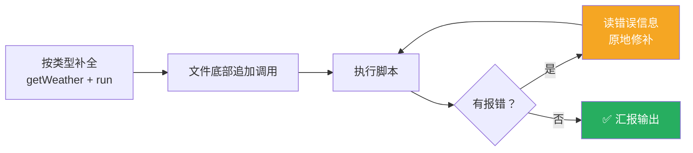
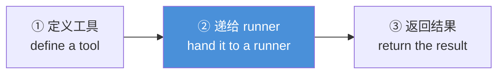

# Claude Platform 101: 《Building with Claude Code》用 Claude Code 写 API 代码

> **课程出处**：Anthropic 官方 Claude Academy (`academy.claude.com/courses/claude-platform-101/building-with-claude-code`)  
> **课程定位**：收官课——手写调用 Claude API 的代码没问题，但有条更快的路：**让 Claude 替你写**；用 Claude Code 从 stub 文件补全 API 集成，用的正是本课程全程所学的原语  
> **核心主题**：Claude API 内置 Skill、三要素好 Prompt、定义-递交-返回的通用形状、审查 diff  
> **课程时长**：约 5 分钟（第 13/13 课）

---

## 目录
1. [起点：一个 stub 文件](#1-起点一个-stub-文件)
2. [Claude API Skill](#2-claude-api-skill)
3. [一条 Prompt 出可运行代码](#3-一条-prompt-出可运行代码)
4. [要记住的形状](#4-要记住的形状)
5. [实战 Cheatsheet](#5-实战-cheatsheet)

---

## 1. 起点：一个 stub 文件

项目很简单：一个取天气的 TypeScript 文件，含两个 stub：

- **`getWeather`**——接收城市，返回温度和天气状况
- **`run`**——应使用 **Tool Runner** + Claude TypeScript SDK 的函数

> **Tool Runner** 就是替你处理工具调用和 Agent 循环的那块（L5）——不用手动接线。

## 2. Claude API Skill

Claude Code 内置了一个叫 **Claude API** 的 Skill（呼应 Claude Code L10）：

- 可直接 `/claude-api` 显式调用
- 或 Claude Code **检测到你用 TypeScript SDK 时自动加载**

## 3. 一条 Prompt 出可运行代码

终端打开项目文件夹 → 启动 Claude Code → **一条 Prompt 搞定**。

### 好 Prompt 三要素

| 要素 | 说明 |
| :--- | :--- |
| **点名文件** | 要改哪个文件 |
| **点名模式** | 用什么 pattern（如 tool runner） |
| **点名终态** | 期望的最终状态 |

### Claude Code 的完整动作



### 本次产出

- 一个 **Zod tool**：解析输入，按 city 类型返回输出
- 请求的 **tool runner** 和 `run` 函数
- 打印 Agent 循环的最终结果

> 💡 与 Claude Code L7「Code review」闭环呼应：Agent 写的代码，**你 review diff**——这正是本课存在的意义（课程简介原话：你需要知道好代码长什么样，才审得了 Agent 替你写的代码）。

## 4. 要记住的形状

> 你写给 Claude API 的大部分代码都是一个熟悉的形状：



**不必每次凭记忆敲**：

> Stub the file, hand it to Claude Code, and just review the diff.  
> （写好 stub → 交给 Claude Code → 只审 diff。）

## 5. 实战 Cheatsheet

```markdown
### ⚡ Claude Code 写 API 代码速查

#### 1. 内置 Skill
Claude API skill：/claude-api 显式调用
或检测到 TypeScript SDK 自动加载

#### 2. 好 Prompt 三要素
点名文件 + 点名模式（pattern）+ 点名终态（end state）

#### 3. Claude Code 全自动
补全 stub → 追加调用 → 执行 → 报错自动读信息原地修

#### 4. API 代码通用形状
定义工具 → 递给 runner → 返回结果
（配 Zod 解析输入输出）

#### 5. 工作流口诀
Stub it, delegate it, review the diff.
（写 stub、委派它、审 diff）

#### 6. 双向闭环（全课程收束）
Platform 课教你 API 原语 → 看得懂好代码
Claude Code 替你写代码 → 你来 review
（L7 Code review 的三堆处置法在此刻生效）
```

### 课程衔接

> 🔗 **下一步**：[Claude Platform 101 quiz](https://academy.claude.com/courses/claude-platform-101/claude-platform-101-quiz)——结课测验，通过后拿 Completion badge。  
> 之后按板块规划：**Intro to MCP**（10 课 · 1h）→ **Building with the Claude API**（67 课 · 9h）。
