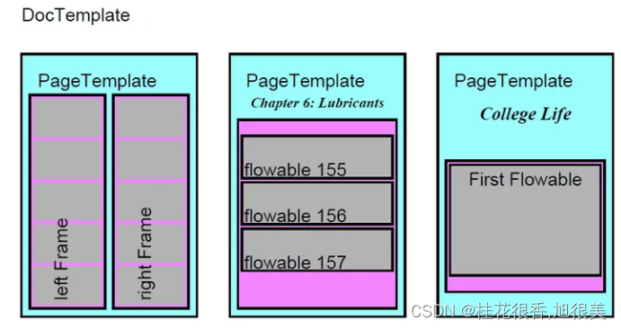

# reportlab

这个包用于导出pdf，更加了灵活，[官方文档](https://docs.reportlab.com/)。

reportlab.platypus (Page Layout and Typography Using Scripts)：
包含以下几种：
Platpus：从上到下，可以被看成具备多个层次
DocTemplates：文档最外层的容器
PageTemplates：各种页面布局的规格
Frames：包含流动的文本和图形的文档区域规范
Flowables：能够被流入文档的文本、图形和段落



## 初始化文档

```python
from reportlab.platypus import SimpleDocTemplate, Paragraph

pdf_name = "test.pdf"
pdf = SimpleDocTemplate(pdf_name)

content = []
content.append(Paragraph("test text", style))

pdf.build(content)
```


在上述代码中，可以看，第一步需要声明文档模板，然后在模板上新增内容即可。

## 支持中文

reportlab默认字符中没有中文，需要自己下载中文字体，然后通过以下代码进行中文适配：

```python
from reportlab.platypus import SimpleDocTemplate, Paragraph
from reportlab.lib.styles import getSampleStyleSheet, ParagraphStyle
from reportlab.pdfbase import pdfmetrics, ttfonts

# 字体所在路径
simsun_font_path = os.path.join(font_dir, 'simsun.ttc')
simhei_font_path = os.path.join(font_dir, 'SIMHEI.TTF')

# 注册字体
pdfmetrics.registerFont(ttfonts.TTFont('SimSun', simsun_font_path))
pdfmetrics.registerFont(ttfonts.TTFont('SimHei', simhei_font_path))

styles = getSampleStyleSheet()
# name为自定义style，parent表示父类，继承父类的style，fontName为上述注册字体
styles.add(ParagraphStyle(name='SimSunPara', parent=styles['Normal'], fontName='SimSun'))

# 使用
paragraph = Paragraph("测试中文文字", styles['SimSunPara'])  # styles的key为上述自定义添加的style

```
