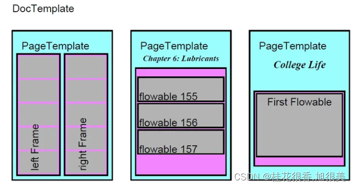

# ReportLab：Python 自动化生成专业 PDF 报表实战指南

[ReportLab](https://docs.reportlab.com/) 是 Python 生态中最强大、最灵活的企业级 PDF 文档生成库，广泛应用于自动化生成工业诊断报告、数据分析周报与财务单据。

---

## 1. Platypus 核心架构概念

Platypus (**P**age **L**ayout **a**nd **Typ**ography **U**sing **S**cripts) 是 ReportLab 的高级排版引擎，采用自上而下的流式布局（Flowable Layout）：

- **DocTemplates (文档模板)**：最外层容器（如 `SimpleDocTemplate`），负责整个 PDF 的尺寸、页边距与页面构建流程。
- **PageTemplates (页面模板)**：定义页面的物理规格与页眉/页脚静态框架。
- **Frames (文本框/区域)**：页面中容纳流式内容的物理矩形区域。
- **Flowables (流式元素)**：能够根据页面剩余空间自动换行与跨页的内容单元，包括 `Paragraph`（段落）、`Table`（表格）、`Image`（图片）、`Spacer`（空白间隔）等。



---

## 2. 生产级 PDF 报表完整生成代码模板

以下代码演示如何在 PDF 中完整实现**中文支持**、**标题段落**、**数据分析表格**、**图表插入**以及**页眉页脚页码回调**：

```python
import os
import matplotlib.pyplot as plt
from reportlab.lib.pagesizes import letter, A4
from reportlab.lib import colors
from reportlab.lib.units import inch, cm
from reportlab.platypus import SimpleDocTemplate, Paragraph, Spacer, Table, TableStyle, Image
from reportlab.lib.styles import getSampleStyleSheet, ParagraphStyle
from reportlab.pdfbase import pdfmetrics
from reportlab.pdfbase.ttfonts import TTFont

# -------------------------------------------------------------
# 1. 注册中文字体 (防止中文显示为方块或乱码)
# -------------------------------------------------------------
# 请替换为系统真实字体路径 (Windows: C:/Windows/Fonts/simhei.ttf, Linux: /usr/share/fonts/...)
font_path = "SimHei.ttf"
if os.path.exists(font_path):
    pdfmetrics.registerFont(TTFont('SimHei', font_path))
    default_font = 'SimHei'
else:
    default_font = 'Helvetica'

# -------------------------------------------------------------
# 2. 初始化样式表
# -------------------------------------------------------------
styles = getSampleStyleSheet()

# 报表大标题样式
title_style = ParagraphStyle(
    name='ReportTitle',
    parent=styles['Heading1'],
    fontName=default_font,
    fontSize=22,
    leading=26,
    alignment=1,  # 居中对齐
    textColor=colors.HexColor("#1A365D"),
    spaceAfter=15
)

# 正文段落样式
body_style = ParagraphStyle(
    name='ReportBody',
    parent=styles['Normal'],
    fontName=default_font,
    fontSize=10.5,
    leading=16,
    textColor=colors.HexColor("#2D3748"),
    spaceAfter=10
)

# -------------------------------------------------------------
# 3. 组装 Flowable 报表内容
# -------------------------------------------------------------
pdf_path = "industrial_diagnostic_report.pdf"
doc = SimpleDocTemplate(
    pdf_path,
    pagesize=A4,
    rightMargin=2*cm,
    leftMargin=2*cm,
    topMargin=2*cm,
    bottomMargin=2*cm
)

story = []

# 标题
story.append(Paragraph("工业设备状态与智能诊断分析周报", title_style))
story.append(Spacer(1, 10))

# 简介段落
intro_text = (
    "本报告由边缘计算网关自动采集并生成。汇总了过去 7 天内核心变压器与电机传感器的遥测时序指标，"
    "结合多元状态估计 (MSET) 算法进行了实时健康度评估。"
)
story.append(Paragraph(intro_text, body_style))
story.append(Spacer(1, 12))

# 数据表格 (Table + TableStyle)
table_data = [
    ["设备编号", "监测指标", "当前均值", "健康度得分", "预警等级"],
    ["Sensor_01", "轴承振动 (RMS)", "0.042 mm/s", "96.5", "正常"],
    ["Sensor_02", "电机温度 (Temp)", "78.4 ℃", "88.2", "注意"],
    ["Sensor_03", "进气压力 (Press)", "1.82 MPa", "99.1", "正常"],
    ["Sensor_04", "绕组电流 (Current)", "14.2 A", "64.0", "警告"]
]

styled_table = Table(table_data, colWidths=[3*cm, 4*cm, 3*cm, 3*cm, 3*cm])
styled_table.setStyle(TableStyle([
    ('BACKGROUND', (0, 0), (-1, 0), colors.HexColor("#2B6CB0")), # 表头深蓝底色
    ('TEXTCOLOR', (0, 0), (-1, 0), colors.whitesmoke),          # 表头白字
    ('ALIGN', (0, 0), (-1, -1), 'CENTER'),                       # 全局居中
    ('FONTNAME', (0, 0), (-1, -1), default_font),                # 中文字体
    ('FONTSIZE', (0, 0), (-1, -1), 10),
    ('BOTTOMPADDING', (0, 0), (-1, -1), 6),
    ('TOPPADDING', (0, 0), (-1, -1), 6),
    ('GRID', (0, 0), (-1, -1), 0.5, colors.HexColor("#CBD5E0")), # 细网格边框
    ('ROWBACKGROUNDS', (0, 1), (-1, -1), [colors.white, colors.HexColor("#F7FAFC")]), # 斑马纹交替底色
    ('TEXTCOLOR', (4, 4), (4, 4), colors.red),                   # 警告行高亮红字
]))
story.append(styled_table)
story.append(Spacer(1, 15))

# 插入趋势分析折线图 (Matplotlib 绘图并嵌入)
chart_img_path = "temp_trend.png"
plt.figure(figsize=(6, 2.5), dpi=150)
plt.plot([1, 2, 3, 4, 5, 6, 7], [70, 72, 71, 75, 76, 79, 78], marker='o', color='#3182CE')
plt.title("7-Day Temperature Trend (°C)")
plt.grid(True, linestyle='--', alpha=0.6)
plt.tight_layout()
plt.savefig(chart_img_path)
plt.close()

if os.path.exists(chart_img_path):
    story.append(Image(chart_img_path, width=15*cm, height=6.25*cm))
    story.append(Spacer(1, 10))

# -------------------------------------------------------------
# 4. 页眉与页脚页码回调函数
# -------------------------------------------------------------
def add_header_footer(canvas, doc):
    canvas.saveState()
    # 页眉
    canvas.setFont(default_font, 8)
    canvas.setFillColor(colors.gray)
    canvas.drawString(2*cm, 28*cm, "IoT 工业智能物联网平台 - 自动导出报告")
    canvas.setStrokeColor(colors.lightgrey)
    canvas.setLineWidth(0.5)
    canvas.line(2*cm, 27.8*cm, 19*cm, 27.8*cm)
    
    # 页脚
    page_num = canvas.getPageNumber()
    canvas.drawRightString(19*cm, 1.5*cm, f"第 {page_num} 页")
    canvas.restoreState()

# 构建输出 PDF
doc.build(story, onFirstPage=add_header_footer, onLaterPages=add_header_footer)
print(f"成功生成报表: {pdf_path}")
```

---

## 3. 常见避坑指南

1. **中文方块 / 乱码**：必须显式调用 `pdfmetrics.registerFont(TTFont(...))` 并在 `ParagraphStyle` 或 `TableStyle` 中指定 `fontName`。
2. **段落超出页面不换行**：在 Table 单元格内如果需要多行文本，需将字符串包装在 `Paragraph("内容", style)` 中传入 Table，而非直接传入裸字符串。
3. **Leading 行距设置**：自定义 `ParagraphStyle` 时，如果修改了 `fontSize`，必须同步调大 `leading`（一般设为字号的 1.2 ~ 1.5 倍），否则多行文字会发生上下重叠。
