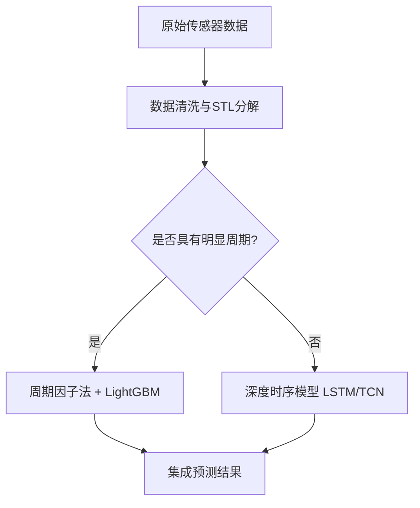

# Markdown 实用语法与排版速查指南

---

## 1. 常用基础排版

### 标题与目录
```markdown
# 一级标题
## 二级标题
### 三级标题
```

### 强调与引用
```markdown
**加粗文字**
*斜体文字*
~~删除线~~
`行内代码`

> 单层引用文本
>> 嵌套引用文本
```

### 列表与任务清单
```markdown
- 无序列表项 A
- 无序列表项 B
  - 二级缩进项

1. 有序列表 1
2. 有序列表 2

- [x] 已完成任务
- [ ] 待办任务项
```

### 表格 (Table)
```markdown
| 算法名称 | 适用场景 | 复杂度 | 状态 |
| :--- | :--- | :---: | ---: |
| MSET | 工业设备状态估计 | $O(N^3)$ | 已上线 |
| LightGBM | 结构化特征回归/分类 | $O(K \cdot N)$ | 生产中 |
```

---

## 2. 代码块与语法高亮

````markdown
```python
def calculate_loss(y_true: np.ndarray, y_pred: np.ndarray) -> float:
    """计算均方误差 (MSE)"""
    return np.mean((y_true - y_pred) ** 2)
```
````

---

## 3. 数学公式 (LaTeX / KaTeX)

### 行内公式 (Inline Math)
代码：`时序预测步长为 $T$，自回归项为 $X_{t-1}$。`  
效果：时序预测步长为 $T$，自回归项为 $X_{t-1}$。

### 独立块级公式 (Block Math)
```latex
$$
\text{Attention}(Q, K, V) = \text{softmax}\left(\frac{QK^T}{\sqrt{d_k}}\right)V
$$
```

---

## 4. Mermaid 流程图与架构图

````markdown

````

---

## 5. 提示信息块 (GitHub Alerts)

```markdown
> [!NOTE]
> 常用提示与补充信息。

> [!TIP]
> 实用技巧与性能优化建议。

> [!IMPORTANT]
> 关键要求与核心约束。

> [!WARNING]
> 潜在隐患与版本兼容警告。

> [!CAUTION]
> 高风险操作（如硬删除、数据清空）。
```
